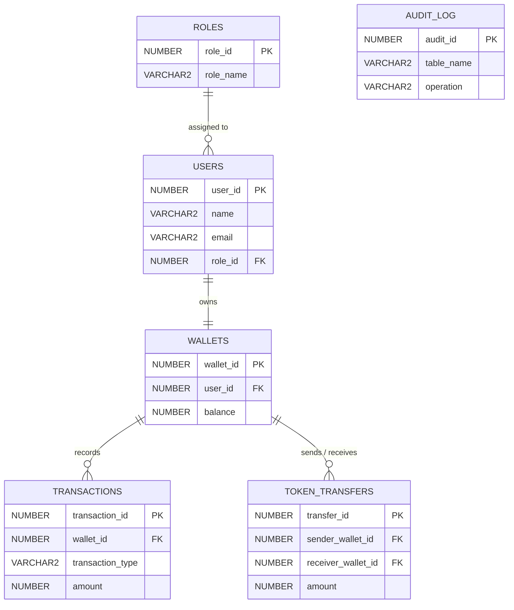

# 🗄️ Funfinity Token System

Funfinity Token System is an Oracle-based database project designed to manage users, roles, digital wallets, token transfers, and transaction records. The main purpose of the project is to demonstrate how SQL and PL/SQL can be used to build a reliable transaction-based system with proper data validation, transaction management, and automatic auditing.

## Project Overview
The system allows registered users to have digital wallets and transfer tokens between each other. Every transfer is validated and recorded in the database, making it possible to track the complete transaction history. 
The project focuses mainly on database design and backend business logic, using Oracle features such as stored procedures, functions, triggers, cursors, views, indexes, and transaction control.

## Key Features
* **Role-Based User Management:** Supports different roles such as ADMIN, MANAGER, and USER.
* **Digital Wallet Management:** Each user can have a wallet with a maintained token balance. Constraints are used to prevent invalid balances and duplicate wallets.
* **Token Transfer System:** Users can transfer tokens from one wallet to another through the `TRANSFER_TOKENS` PL/SQL procedure.
* **Transaction Management:** Every transfer generates corresponding debit and credit records, keeping the transaction history organized.
* **Automatic Audit Logging:** Database triggers automatically record important changes such as wallet balance updates and token transfers.
* **Transaction Safety:** COMMIT, ROLLBACK, and SAVEPOINT are used to ensure that token transfers remain consistent even when an error occurs.
* **Reporting & Performance:** Views, indexes, and explicit cursors are used for easier reporting and efficient data retrieval.

## Database Structure
The system consists of six main tables. Primary Keys, Foreign Keys, UNIQUE constraints, CHECK constraints, and sequences are used to maintain data integrity.



| Table | Description |
| :--- | :--- |
| **ROLES** | Stores the different roles available in the system |
| **USERS** | Stores user details and account status |
| **WALLETS** | Maintains token balances for users |
| **TOKEN_TRANSFERS** | Records token transfers between users |
| **TRANSACTIONS** | Stores debit and credit transaction details |
| **AUDIT_LOG** | Maintains automatic records of important database changes |

## Technologies Used
* Oracle Database
* SQL & PL/SQL
* Oracle SQL Developer

## Project Structure
```text
Funfinity Token System/
├── database/
│   ├── tables.sql
│   ├── constraints.sql
│   ├── sequences.sql
│   ├── sample_data.sql
│   ├── views.sql
│   ├── indexes.sql
│   └── triggers.sql
└── plsql/
    ├── procedures.sql
    ├── functions.sql
    ├── exceptions.sql
    └── transaction_demo.sql
```

## ⚙️ Setup & Execution
Execute the scripts in the following order in Oracle SQL Developer:

```sql
@database/tables.sql
@database/constraints.sql
@database/sequences.sql
@database/sample_data.sql
@database/views.sql
@database/indexes.sql
@database/triggers.sql
@plsql/procedures.sql
@plsql/functions.sql
```

## Project Objective

The objective of this project is to demonstrate how a token-based transaction system works at the database level. It combines database normalization, PL/SQL programming, triggers, and auditing to create a system where token transfers are consistent, traceable, and safely managed.
