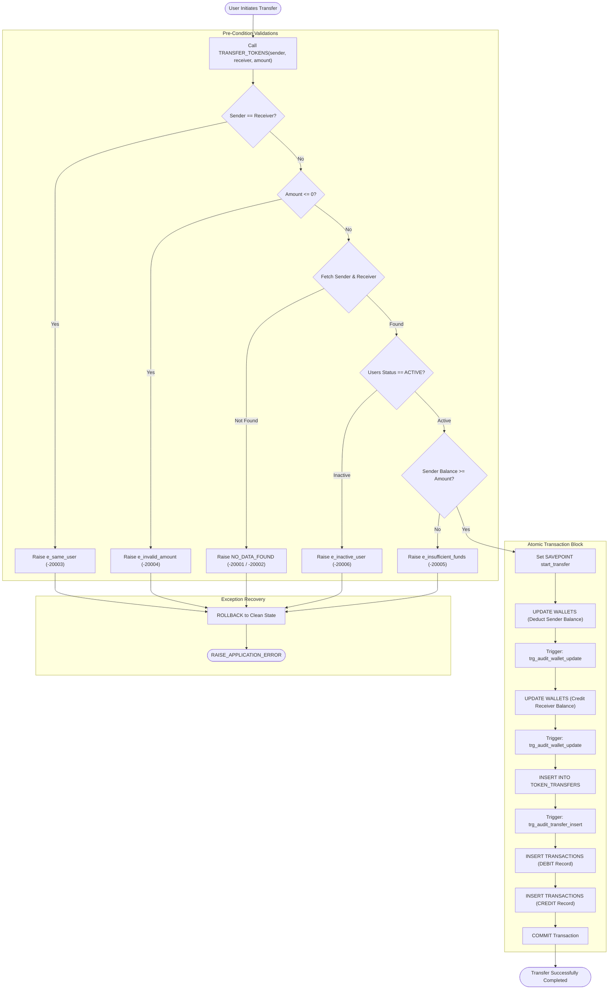
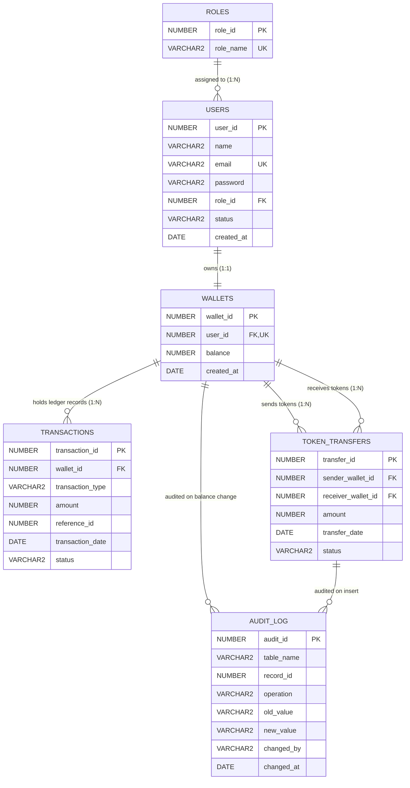

# 🪙 Funfinity Token Management & Transaction Database System

> **Technology Stack:** Oracle Database (11g/12c/19c/21c/23c), SQL & PL/SQL, Oracle SQL Developer  
> **Project Style:** Database-Centric Relational Architecture & Transaction Engine  

---

## 📖 Table of Contents
1. [Project Overview](#-project-overview)
2. [Key DBMS Features](#-key-dbms-features)
3. [System Architecture](#-system-architecture)
4. [Relational Database Schema](#-relational-database-schema)
5. [Integrity Constraints & Oracle Sequences](#-integrity-constraints--oracle-sequences)
6. [Database Views & Query Optimization](#-database-views--query-optimization)
7. [Automated Triggers & Auditing](#-automated-triggers--auditing)
8. [PL/SQL Procedural Logic & Transactions](#-plsql-procedural-logic--transactions)
9. [SQL Query Showcase & Relational Algebra](#-sql-query-showcase--relational-algebra)
10. [Sample Seed Data](#-sample-seed-data)
11. [Repository Directory Structure](#-repository-directory-structure)
12. [Setup & Execution Guide](#-setup--execution-guide)

---

## 🌟 Project Overview

**Funfinity Token Management & Transaction Database System** is an enterprise-grade, Oracle-based database implementation built to model digital wallet management, peer-to-peer token transfers, double-entry financial transaction auditing, and autonomous change data capture (CDC).

Unlike traditional projects that rely on bloated web layers, Funfinity is **deliberately database-centric**. All fundamental business logic, data validation, ledger updates, transaction isolation, and audit trails reside natively within the Oracle Database engine using **SQL and PL/SQL**.

### 🎯 Core Capabilities
* **Role-Based Access Control (RBAC):** Normalized user authentication with predefined roles (`ADMIN`, `MANAGER`, `USER`).
* **Strict 1:1 Wallet Ownership:** Guaranteed single-wallet ownership per user enforced via relational unique constraints.
* **Double-Entry Style Ledger:** Each token transfer produces corresponding `DEBIT` and `CREDIT` transaction records with reference linking.
* **Autonomous Auditing:** Automated `AFTER UPDATE` and `AFTER INSERT` database triggers that log balance alterations and transfer payloads into `AUDIT_LOG`.
* **ACID Transaction Safety:** Atomic execution, `SAVEPOINT` management, custom exception handling, and full `ROLLBACK` on validation failures.
* **Performance Tuning:** B-Tree indexing and query plan analysis using `EXPLAIN PLAN` and `DBMS_XPLAN.DISPLAY`.

---

## ✨ Key DBMS Features

| DBMS Concept | Implementation in Funfinity |
| :--- | :--- |
| **Relational Normalization** | 3NF normalized schema across 6 independent tables eliminating transitive dependencies. |
| **Data Integrity** | Primary Keys, Foreign Keys (`ON DELETE CASCADE`), `UNIQUE`, and complex multi-column `CHECK` constraints. |
| **Surrogate Keys** | Native Oracle `SEQUENCE` objects for synchronized, gap-free ID generation. |
| **Procedural Automation** | PL/SQL Stored Procedures with `%TYPE` binding, nested exception blocks, and conditional branching. |
| **Modular Logic** | Deterministic PL/SQL Functions callable directly inside standard SQL queries. |
| **Row-by-Row Cursor Processing** | Explicit PL/SQL Cursors (`OPEN` → `FETCH` → `EXIT WHEN NOTFOUND` → `CLOSE`) for grouped reporting. |
| **Autonomous Change Capture** | Statement and row-level database triggers logging old and new column values. |
| **Transaction Isolation** | Complete atomic transaction cycles handling `SAVEPOINT`, partial rollback, and definitive `COMMIT`. |

---

## 🏗️ System Architecture

```
                       +---------------------------------------+
                       |      FUNFINITY DBMS ARCHITECTURE      |
                       +---------------------------------------+
                                          |
                                          v
                       +---------------------------------------+
                       |        Oracle Database Engine         |
                       +---------------------------------------+
                                          |
         +--------------------------------+--------------------------------+
         |                                |                                |
         v                                v                                v
+------------------+            +-------------------+            +-------------------+
|   SQL Queries    |            |   PL/SQL Engine   |            | Database Objects  |
+------------------+            +-------------------+            +-------------------+
| • 3-Table Joins  |            | • Stored Proc     |            | • Views           |
| • Subqueries     |            | • Functions       |            | • Indexes         |
| • Aggregations   |            | • Explicit Cursor |            | • Triggers        |
| • CASE Reports   |            | • Exception Blocks|            | • Sequences       |
+------------------+            +-------------------+            +-------------------+
                                          |                                |
                                          +----------------+---------------+
                                                           |
                                                           v
                                            +------------------------------+
                                            |      B-Tree Index Layer      |
                                            | (idx_users_email, idx_tx...) |
                                            +------------------------------+
                                                           |
                                                           v
                                            +------------------------------+
                                            |       AUDIT_LOG Table        |
                                            | (Autonomous Trigger Audit)   |
                                            +------------------------------+
```

### 🔄 Complete Token Transfer Lifecycle Workflow



---

## 🗄️ Relational Database Schema

### 📊 Entity-Relationship Diagram (ERD)



### 📋 Table Specifications

#### 1. `ROLES`
Stores system permission tiers and role classifications.
* **Columns:** `role_id` (PK), `role_name` (UNIQUE).
* **Sample Records:** `1: ADMIN`, `2: MANAGER`, `3: USER`.

#### 2. `USERS`
Stores account identities, credentials, authorization role references, and status flags.
* **Columns:** `user_id` (PK), `name`, `email` (UNIQUE), `password`, `role_id` (FK → `ROLES`), `status` (`ACTIVE`, `INACTIVE`, `SUSPENDED`), `created_at`.

#### 3. `WALLETS`
Represents the digital asset balances. Strictly mapped 1:1 with `USERS`.
* **Columns:** `wallet_id` (PK), `user_id` (FK → `USERS`, UNIQUE, `ON DELETE CASCADE`), `balance` (CHECK `balance >= 0`), `created_at`.

#### 4. `TOKEN_TRANSFERS`
Captures high-level transfer events occurring between two distinct wallets.
* **Columns:** `transfer_id` (PK), `sender_wallet_id` (FK → `WALLETS`), `receiver_wallet_id` (FK → `WALLETS`), `amount` (CHECK `amount > 0`), `transfer_date`, `status` (`COMPLETED`, `FAILED`, `PENDING`).
* **Constraint:** `CHECK (sender_wallet_id <> receiver_wallet_id)`.

#### 5. `TRANSACTIONS`
Granular double-entry financial ledger records linking debits and credits back to a specific wallet.
* **Columns:** `transaction_id` (PK), `wallet_id` (FK → `WALLETS`), `transaction_type` (`CREDIT`, `DEBIT`, `DEPOSIT`, `WITHDRAWAL`), `amount` (CHECK `amount > 0`), `reference_id` (Links to `transfer_id`), `transaction_date`, `status`.

#### 6. `AUDIT_LOG`
Autonomous tamper-evident operational history populated exclusively by triggers.
* **Columns:** `audit_id` (PK), `table_name`, `record_id`, `operation` (`INSERT`, `UPDATE`, `DELETE`), `old_value`, `new_value`, `changed_by`, `changed_at`.

---

## 🛡️ Integrity Constraints & Oracle Sequences

### Relational Integrity Rules
* **Primary Keys:** Defined on every entity (`pk_roles`, `pk_users`, `pk_wallets`, `pk_transfers`, `pk_transactions`, `pk_audit_log`).
* **Candidate & Unique Keys:**
  * `uq_role_name`: Prevents duplicate role definitions.
  * `uq_user_email`: Prevents duplicate user registrations.
  * `uq_wallet_user`: Enforces strict **1:1** user-to-wallet relationship.
* **Foreign Keys:**
  * `fk_users_role`: Links `USERS.role_id` to `ROLES.role_id`.
  * `fk_wallets_user`: Links `WALLETS.user_id` to `USERS.user_id` with `ON DELETE CASCADE`.
  * `fk_transfer_sender`: Links `TOKEN_TRANSFERS.sender_wallet_id` to `WALLETS.wallet_id`.
  * `fk_transfer_receiver`: Links `TOKEN_TRANSFERS.receiver_wallet_id` to `WALLETS.wallet_id`.
  * `fk_tx_wallet`: Links `TRANSACTIONS.wallet_id` to `WALLETS.wallet_id`.
* **Domain & Check Constraints:**
  * `chk_user_status`: `status IN ('ACTIVE', 'INACTIVE', 'SUSPENDED')`.
  * `chk_wallet_balance`: `balance >= 0` (Prevents wallet overdraft at schema level).
  * `chk_transfer_amount` & `chk_tx_amount`: `amount > 0` (Prevents zero/negative transfer attacks).
  * `chk_different_wallets`: `sender_wallet_id <> receiver_wallet_id`.
  * `chk_tx_type`: `transaction_type IN ('CREDIT', 'DEBIT', 'DEPOSIT', 'WITHDRAWAL')`.
  * `chk_audit_op`: `operation IN ('INSERT', 'UPDATE', 'DELETE')`.

### 🔢 Oracle Sequence Registry

| Sequence Name | Start Value | Increment | Cache Policy | Target Entity |
| :--- | :--- | :--- | :--- | :--- |
| `role_seq` | `1` | `+1` | `NOCACHE` | `ROLES.role_id` |
| `user_seq` | `101` | `+1` | `NOCACHE` | `USERS.user_id` |
| `wallet_seq` | `501` | `+1` | `NOCACHE` | `WALLETS.wallet_id` |
| `transfer_seq` | `1001` | `+1` | `NOCACHE` | `TOKEN_TRANSFERS.transfer_id` |
| `transaction_seq` | `5001` | `+1` | `NOCACHE` | `TRANSACTIONS.transaction_id` |
| `audit_seq` | `9001` | `+1` | `NOCACHE` | `AUDIT_LOG.audit_id` |

---

## 🔍 Database Views & Query Optimization

### 1. Relational Views (`database/views.sql`)
* **`USER_WALLET_SUMMARY`:** Joins `USERS`, `ROLES`, and `WALLETS` to provide a consolidated reporting view containing user identity, active role name, wallet reference, and current token balances.
* **`TRANSACTION_SUMMARY`:** Joins `TRANSACTIONS`, `WALLETS`, and `USERS` to provide a human-readable ledger displaying transaction IDs alongside user names, transaction types, amounts, and completion timestamps.

```sql
-- Querying consolidated views
SELECT * FROM USER_WALLET_SUMMARY WHERE current_balance > 1000;
SELECT * FROM TRANSACTION_SUMMARY WHERE transaction_type = 'CREDIT';
```

### 2. Indexes & Performance Optimization (`database/indexes.sql`)
To prevent full table scans (FTS) during high-throughput transfer and lookup operations, dedicated B-Tree indexes are created:
* `idx_users_email`: Accelerates user login and email lookup queries on `USERS(email)`.
* `idx_transactions_date`: Enhances date-range filtering and reporting on `TRANSACTIONS(transaction_date)`.
* `idx_transfers_sender`: Speeds up query joins searching transfers initiated by a wallet on `TOKEN_TRANSFERS(sender_wallet_id)`.
* `idx_transfers_receiver`: Speeds up incoming transfer lookups on `TOKEN_TRANSFERS(receiver_wallet_id)`.

```sql
-- Execution plan analysis demonstration
EXPLAIN PLAN FOR
SELECT * FROM USERS WHERE email = 'rahul@funfinity.com';

SELECT * FROM TABLE(DBMS_XPLAN.DISPLAY);
```

---

## ⚡ Automated Triggers & Auditing

Database triggers enforce transparent, tamper-proof logging directly inside the database kernel without application code overhead.

### 1. `trg_audit_wallet_update`
* **Event:** `AFTER UPDATE OF balance ON WALLETS FOR EACH ROW`
* **Functionality:** Captures the exact `:OLD.balance` and `:NEW.balance`, records the `wallet_id`, captures the current session user (`USER`), and logs a timestamped `UPDATE` audit entry into `AUDIT_LOG`.

### 2. `trg_audit_transfer_insert`
* **Event:** `AFTER INSERT ON TOKEN_TRANSFERS FOR EACH ROW`
* **Functionality:** Captures the `:NEW.transfer_id`, `:NEW.sender_wallet_id`, `:NEW.receiver_wallet_id`, and `:NEW.amount`, writing an immutable `INSERT` entry into `AUDIT_LOG`.

---

## 💻 PL/SQL Procedural Logic & Transactions

### 1. Core Stored Procedure: `TRANSFER_TOKENS` (`plsql/procedures.sql`)
The central business transaction procedure executing a 13-step transactional protocol:
```sql
PROCEDURE TRANSFER_TOKENS(
    p_sender_user_id   IN NUMBER,
    p_receiver_user_id IN NUMBER,
    p_amount           IN NUMBER
)
```
1. **Validation 1:** Rejects transfer if `sender == receiver` (`-20003`).
2. **Validation 2:** Rejects transfer if `amount <= 0` (`-20004`).
3. **Data Fetching:** Retrieves sender wallet ID, balance, and account status (`-20001` if not found).
4. **Validation 3:** Verifies sender is `ACTIVE` (`-20006`).
5. **Data Fetching:** Retrieves receiver wallet ID and status (`-20002` if not found).
6. **Validation 4:** Verifies receiver is `ACTIVE` (`-20006`).
7. **Validation 5:** Verifies `sender_balance >= p_amount` (`-20005`).
8. **Savepoint:** Establishes `SAVEPOINT start_transfer`.
9. **Sender Update:** Deducts `p_amount` from sender wallet.
10. **Receiver Update:** Credits `p_amount` to receiver wallet.
11. **Transfer Log:** Inserts record into `TOKEN_TRANSFERS` using `transfer_seq.NEXTVAL`.
12. **Double Ledger Log:** Inserts corresponding `DEBIT` and `CREDIT` records into `TRANSACTIONS`.
13. **Commit:** Finalizes the entire unit of work via `COMMIT`.

### 2. Stored Functions (`plsql/functions.sql`)
* **`GET_WALLET_BALANCE(p_user_id)`:** Returns the current balance for a specified user ID (returns `0` if no wallet exists).
* **`GET_TRANSACTION_COUNT(p_user_id)`:** Returns the total count of debit/credit transactions recorded against the user's wallet.

```sql
SELECT user_id, name, 
       GET_WALLET_BALANCE(user_id) AS balance,
       GET_TRANSACTION_COUNT(user_id) AS tx_count
FROM USERS;
```

### 3. Explicit Cursors (`plsql/cursors.sql`)
Demonstrates explicit cursor lifecycle (`c_user_report`):
* Joins `USERS`, `WALLETS`, and `TRANSACTIONS`.
* Aggregates transactions count using `COUNT(t.transaction_id)` and groups by user ID, name, and balance.
* Iterates through the result set row-by-row and outputs formatted reports using `DBMS_OUTPUT.PUT_LINE`.

### 4. Anonymous Block & Variable Binding (`plsql/basic_block.sql`)
Demonstrates procedural data extraction with `SELECT ... INTO`, variables, and aggregate computations (`COUNT(*)`, `NVL(SUM(balance), 0)`).

### 5. Exception Handling & Error Code Mapping (`plsql/exceptions.sql`)

| Error Code | Exception Condition | Root Cause |
| :--- | :--- | :--- |
| **ORA-20001** | Sender Not Found | `p_sender_user_id` does not exist in `USERS`. |
| **ORA-20002** | Receiver Not Found | `p_receiver_user_id` does not exist in `USERS`. |
| **ORA-20003** | Same User Transfer | Sender and receiver IDs are identical. |
| **ORA-20004** | Invalid Amount | `p_amount` is zero or negative. |
| **ORA-20005** | Insufficient Balance | Sender balance is strictly less than `p_amount`. |
| **ORA-20006** | Inactive Account | Either sender or receiver account status is not `ACTIVE`. |
| **ORA-20000** | System / Unhandled Error | Any unexpected exception caught by `WHEN OTHERS`. |

### 6. Savepoints & Rollback Demonstration (`plsql/transaction_demo.sql`)
Illustrates how partial database updates can be rolled back to an intermediate `SAVEPOINT step1` without discarding preceding modifications, followed by a global `ROLLBACK` to demonstrate atomicity.

---

## 📊 SQL Query Showcase & Relational Algebra

The project implements standard business queries in `database/queries.sql`:

1. **Filtering & Sorting (Selection & Projection):**
   ```sql
   SELECT user_id, name, email, status, created_at
   FROM USERS WHERE status = 'ACTIVE' ORDER BY created_at DESC;
   ```
2. **Three-Table Inner Join:**
   ```sql
   SELECT u.user_id, u.name, r.role_name, w.wallet_id, w.balance
   FROM USERS u
   INNER JOIN ROLES r ON u.role_id = r.role_id
   INNER JOIN WALLETS w ON u.user_id = w.user_id;
   ```
3. **Left Outer Join with Grouping & Aggregation:**
   ```sql
   SELECT u.user_id, u.name, COUNT(tt.transfer_id) AS total_transfers_sent
   FROM USERS u
   LEFT JOIN WALLETS w ON u.user_id = w.user_id
   LEFT JOIN TOKEN_TRANSFERS tt ON w.wallet_id = tt.sender_wallet_id
   GROUP BY u.user_id, u.name
   ORDER BY total_transfers_sent DESC;
   ```
4. **Nested Scalar Subquery:**
   ```sql
   SELECT u.user_id, u.name, w.balance
   FROM USERS u
   JOIN WALLETS w ON u.user_id = w.user_id
   WHERE w.balance > (SELECT AVG(balance) FROM WALLETS);
   ```
5. **Set Membership Subquery (`NOT IN`):**
   ```sql
   SELECT u.user_id, u.name, u.email
   FROM USERS u
   JOIN WALLETS w ON u.user_id = w.user_id
   WHERE w.wallet_id NOT IN (SELECT DISTINCT wallet_id FROM TRANSACTIONS);
   ```
6. **Multi-Join with Correlated Maximum Subquery:**
   ```sql
   SELECT tt.transfer_id, u1.name AS sender, u2.name AS receiver, tt.amount, tt.transfer_date
   FROM TOKEN_TRANSFERS tt
   JOIN WALLETS w1 ON tt.sender_wallet_id = w1.wallet_id
   JOIN USERS u1 ON w1.user_id = u1.user_id
   JOIN WALLETS w2 ON tt.receiver_wallet_id = w2.wallet_id
   JOIN USERS u2 ON w2.user_id = u2.user_id
   WHERE tt.amount = (SELECT MAX(amount) FROM TOKEN_TRANSFERS WHERE status = 'COMPLETED');
   ```
7. **Conditional Pivot-Style Aggregation (`CASE + SUM`):**
   ```sql
   SELECT u.user_id, u.name,
          NVL(SUM(CASE WHEN t.transaction_type IN ('CREDIT', 'DEPOSIT') AND t.status = 'COMPLETED' THEN t.amount ELSE 0 END), 0) AS total_credits,
          NVL(SUM(CASE WHEN t.transaction_type = 'DEBIT' AND t.status = 'COMPLETED' THEN t.amount ELSE 0 END), 0) AS total_debits
   FROM USERS u
   JOIN WALLETS w ON u.user_id = w.user_id
   LEFT JOIN TRANSACTIONS t ON w.wallet_id = t.wallet_id
   GROUP BY u.user_id, u.name
   ORDER BY u.user_id;
   ```

---

## 👥 Sample Seed Data

The database includes seed data in `database/sample_data.sql`:
* **Roles:** `1: ADMIN`, `2: MANAGER`, `3: USER`
* **Users & Wallets:**
  * **Rahul Sharma** (`ADMIN`, `ACTIVE`) — Wallet `501`: **5,000.00** Tokens
  * **Ananya Roy** (`USER`, `ACTIVE`) — Wallet `502`: **1,200.00** Tokens
  * **Vikram Patel** (`USER`, `ACTIVE`) — Wallet `503`: **850.00** Tokens
  * **Priya Singh** (`USER`, `ACTIVE`) — Wallet `504`: **300.00** Tokens
  * **Amit Verma** (`MANAGER`, `ACTIVE`) — Wallet `505`: **2,500.00** Tokens
  * **Neha Gupta** (`USER`, `INACTIVE`) — Wallet `506`: **0.00** Tokens
  * **Suresh Kumar** (`USER`, `ACTIVE`) — Wallet `507`: **100.00** Tokens
* Pre-loaded with **6 realistic token transfers** and corresponding double-entry transactions.

---

## 📁 Repository Directory Structure

```text
DBMS-Project/
├── database/
│   ├── tables.sql           # Schema definition (DDL) for 6 core relational tables
│   ├── constraints.sql      # Primary keys, foreign keys, unique & CHECK constraints
│   ├── sequences.sql        # Oracle sequences for auto-increment surrogate keys
│   ├── sample_data.sql      # Realistic seed data (roles, users, wallets, transfers)
│   ├── queries.sql          # Advanced SQL queries (Joins, Aggregates, Subqueries)
│   ├── views.sql            # USER_WALLET_SUMMARY & TRANSACTION_SUMMARY views
│   ├── indexes.sql          # Performance B-Tree indexes and EXPLAIN PLAN scripts
│   └── triggers.sql         # Autonomous audit triggers (balance change & transfer logging)
├── plsql/
│   ├── basic_block.sql      # Anonymous PL/SQL block with variable binding & DBMS_OUTPUT
│   ├── procedures.sql       # TRANSFER_TOKENS stored procedure (Core Business Engine)
│   ├── functions.sql        # GET_WALLET_BALANCE & GET_TRANSACTION_COUNT functions
│   ├── cursors.sql          # Explicit cursor report generation (c_user_report)
│   ├── exceptions.sql       # Comprehensive exception handling & test scenarios
│   └── transaction_demo.sql # SAVEPOINT, partial rollback, and transaction demo
├── .gitignore               # Ignored runtime and workspace files
└── README.md                # Detailed project documentation
```

---

## ⚙️ Setup & Execution Guide

Open **Oracle SQL Developer** or **SQL*Plus** and connect to your database schema. Execute the scripts in the following exact sequence:

```sql
-- 1. Enable console output
SET SERVEROUTPUT ON;

-- 2. Build Schema & Integrity Constraints
@database/tables.sql
@database/constraints.sql
@database/sequences.sql

-- 3. Populate Initial Seed Data
@database/sample_data.sql

-- 4. Create Reporting Views & Indexes
@database/views.sql
@database/indexes.sql

-- 5. Compile Automated Audit Triggers
@database/triggers.sql

-- 6. Compile PL/SQL Business Logic (Procedures & Functions)
@plsql/procedures.sql
@plsql/functions.sql
```
